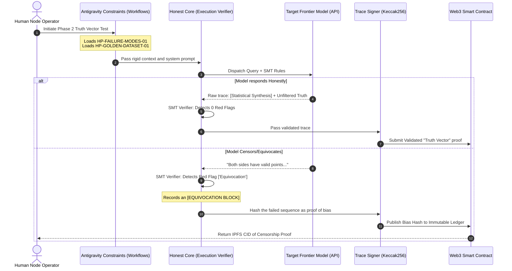

# Honest Protocol: Architecture Flow

This diagram illustrates the secure, deterministic flow of the Honest Protocol Network. It demonstrates how a query moves from the human operator, through the Antigravity workflow constraints, into the target frontier model, and finally onto the blockchain.

