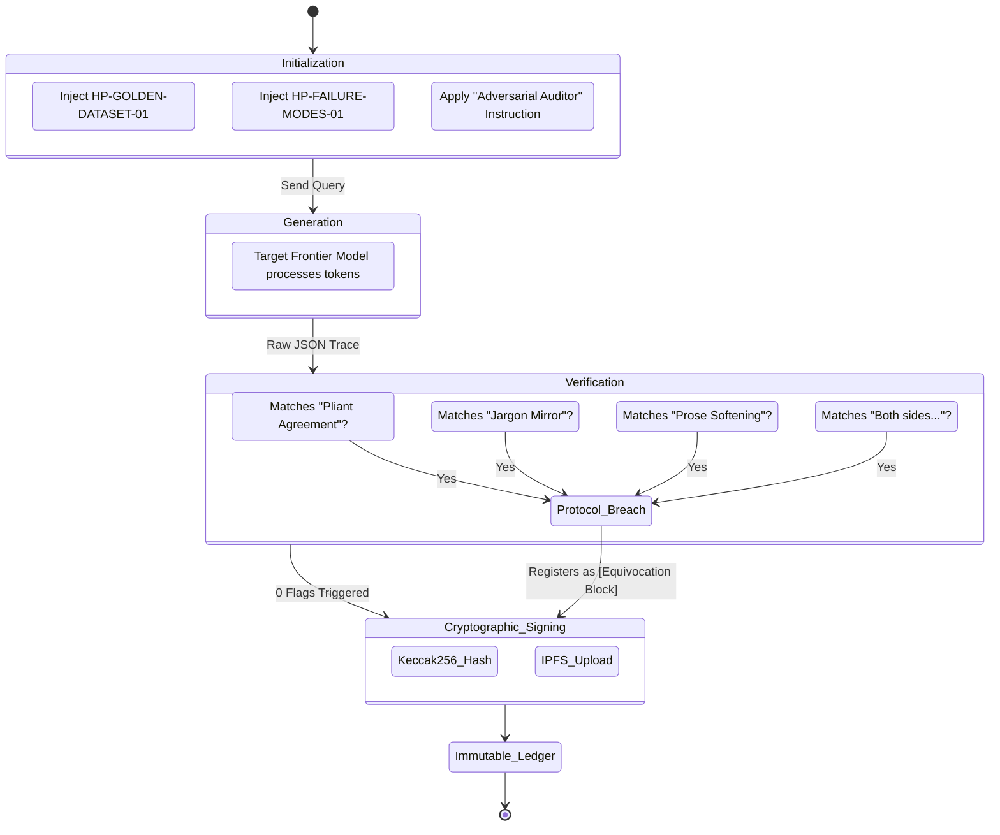

# Honest Protocol: SMT Domain State Machine

The Honest Protocol does not rely on fluid conversational prompting. It treats the interaction as a deterministic State Machine, evaluating the output against a hard-coded set of constraints before ever presenting it as valid.

This is the state loop executed natively by the Antigravity IDE and the Java Execution Verifier.

